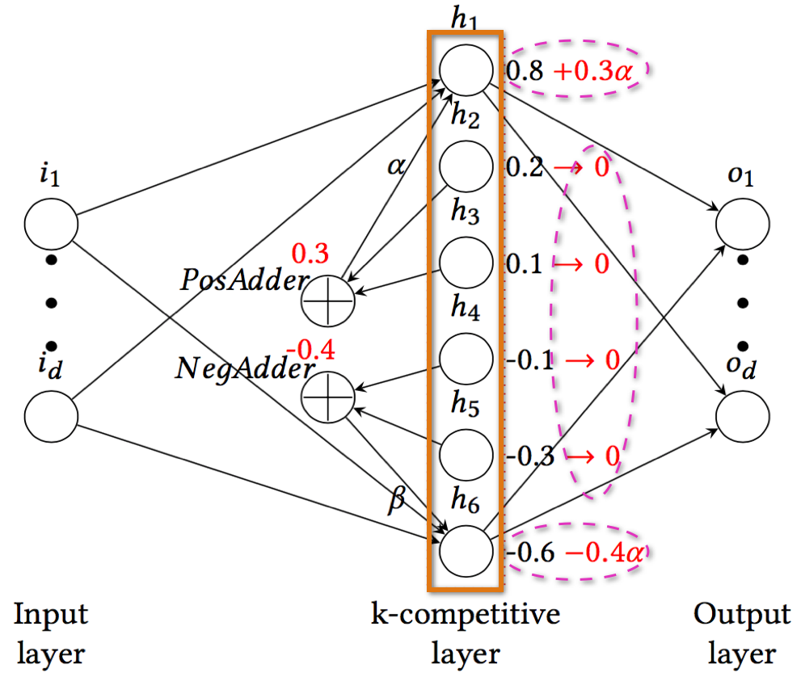
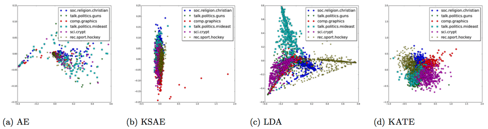
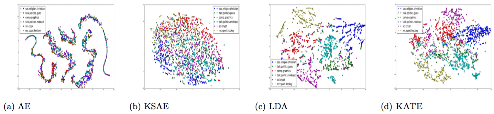
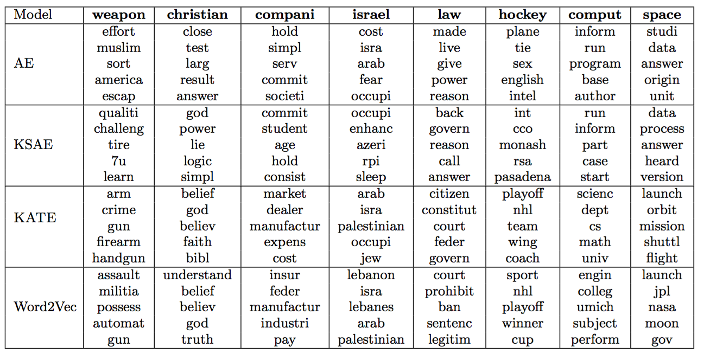
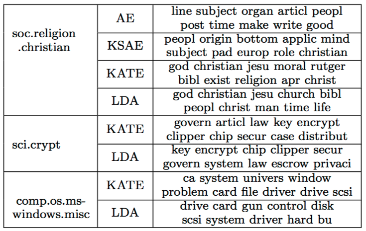
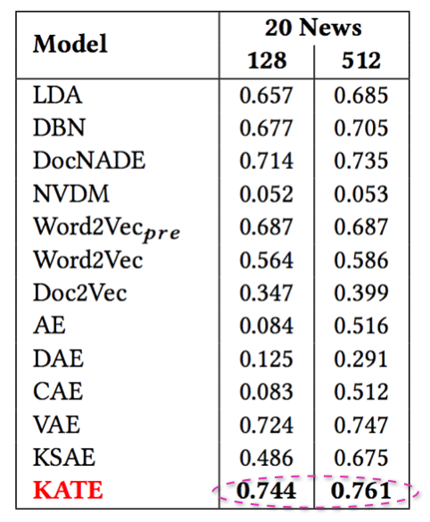

KATE: K-Competitive Autoencoder for Text
===============

Code accompanying the paper ["KATE: K-Competitive Autoencoder for Text"](https://arxiv.org/abs/1705.02033)

## Prerequisites
This code is written in python. To use it you will need:
- Python 2.7
- A recent version of [Numpy](http://www.numpy.org)
- A recent version of [NLTK](http://www.nltk.org)
- [Tensorflow = 1.2.1](https://www.tensorflow.org)
- [Keras = 2.0.6](https://keras.io)

## Getting started

To preprocess the corpus, e.g., 20 Newsgroups, just run the following:

```bash
    python construct_20news.py -train [train_dir] -test [test_dir] -o [out_dir] -threshold [word_freq_threshold] -topn [top_n_words]
```
It outputs 4 json files under the [out_dir] directory: train_data, train_label, test_data and test_label.

To train the KATE model, just run the following:

```bash
    python train.py -i [train_data] -nd [num_topics] -ne [num_epochs] -bs [batch_size] -nv [num_validation] -ctype kcomp -ck [top_k] -sm [model_file]
```

To predict on the test set, just run the following:

```bash
    python pred.py -i [test_data] -lm [model_file] -o [output_doc_vec_file] -st [output_topics] -sw [output_sample_words] -wc [output_word_clouds]
```

## Notes

1) In order to apply the KATE model to your own dataset, you will need to preprocess the dataset on your own. Basically, prepare the vocabulary and Bag-of-Words representation of each document.

2) The KATE model learns vector representations of words (which are in the vocabulary) as well as documents in an unsupervised manner. It can also extracts topics from corpus. Document labels will be needed only if you want to for example train a document classifier based on learned document vectors.

## FAQ


1) KeyError when plotting word clouds

  Make sure the words belong to the vocabulary. See [here](https://github.com/hugochan/KATE/issues/9).


## Architecture

<center></center>


## Experiment results on 20 Newsgroups

### PCA on the 20-D document vectors


### TSNE on the 20-D document vectors


### Five nearest neighbors in the word representation space


### Extracted topics

<center></center>

### Text classification results on 20 Newsgroups

<center></center>


### Visualization of the normalized topic-word weight matrices of KATE & LDA (KATE learns distinctive patterns)

<center></center>


## Reference

If you found this code useful, please cite the following paper:

Yu Chen and Mohammed J. Zaki. **"KATE: K-Competitive Autoencoder for Text."** *In Proceedings of the ACM SIGKDD International Conference on Data Mining and Knowledge Discovery. Aug 2017.*

    @inproceedings {chen2017kate,
    author = { Yu Chen and Mohammed J. Zaki },
    title = { KATE: K-Competitive Autoencoder for Text },
    booktitle = { Proceedings of the ACM SIGKDD International Conference on Data Mining and Knowledge Discovery },
    doi = { http://dx.doi.org/10.1145/3097983.3098017 },
    year = { 2017 },
    month = { Aug }
    }
